# IARPA SMART Overview
The [IARPA Space-Based Machine Automated Recognition Technique (SMART) program](https://www.iarpa.gov/research-programs/smart) aims to automate global-scale detection, classficiation, and monitoring of large-scale anthropogenic activites on the Earth's surface using satellite imagery. 

For more information on the problem formulation and the dataset, please see our [publication](https://doi.org/10.1117/12.2663071). A video recording of the presentation of this paper can be found [here](https://doi.org/10.1117/12.2663071) as well. 


# About this repository

The Johns Hopkins University Applied Physics Laboratory (JHU/APL) led the development of a large Computer Vision/Machine Learning (CV/ML) dataset containing spatio-temporal annotations of large scale heavy construction activity for the purposes of algorithm development and evaluation for automated broad area search and classification of anthropogenic activities from satellite iamgery. 

This repository contains the following key components: 

- The **annotation dataset** (found in [`annotations/`](annotations/)). Throughout the documentation in this Github repository, we refer to this dataset as the `SMART Heavy Construction Dataset`.
- [Instructions for how to obtain some of the underlying and corresponding satellite imagery](documentation/obtain_imagery.md) in which these activities can be observed. 
- Useful **utilities** (found in [`utilities/`](utilities/)) to help get started with and make use of the dataset. 
- A Python-based implementation of **semi-custom performance evaluation metrics** (tailored specifically to the data formats and application introduced here) can be found in `src/`. A publication describing the formulation of the evaluation metrics will be made available soon (expected May 2025 but available upon request prior to official release). 

NOTE: At the time of the initial release, some annotations in the dataset remain sequestered to support independent test and evaluation for the IARPA SMART program and potential follow-on activities. These will remain sequestered (and unreleased here) until they are no longer needed for sequestered testing by the program. Expected release is by January 2025. 

# Terminology

- **Observation**:
  - A single image capturing the actitivy of interest on a specific day. A day is the most granular time-scale considered by SMART

- **Region**: 
  -  An area of interest defining spatial bounds for processing and annotation

- **Region Model**:
  - A data format (GeoJSON) that represents a region's spatial and temporal bounds along with a list of all sites contained within those region bounds. Region models defined in the SMART dataset can be found [here](annotations/region_models/). A region model format specification file can be found [here](documentation/specifications/region_model_spec.md). 

  ***Empty Region Model***: 
  - We also define the concept of an _empty region model_, which defines only the spatial and temporal bounds of the region without the list of sites contained within those regions bounds. These files (also in GeoJSON format) are meant to serve as an input to an algorithm for the sole purpose of defining the spatial and temporal extents over which the algorithm is expected to process (search for activity). 

- **Site / Site Boundary**: 
  - A geographical area defining the spatial boundaries of large-scale change (anthropogenic or not). 
  - This is the fundamental unit of activity that SMART is focused on; it is what human annotators will be labeling and what algorithms are expected to detect and classify. 
  - For SMART, sites of interest must be larger than 8000 m². (Note that this size is in reference to the entire site area, not the objects within the site.). 
  - There can be any number of sites within a `region` (including none)

- **Sub-site / Sub-site Boundary**: 
  - Used to indicate that an area within the site boundary is in a different activity phase as the surrounding or neighboring plots of land
  - Sub-site boundaries are only required _**if and only if**_ the site is exhibiting multiple activity phases in a single time slice
  - Program-defined custom definitions of site and subsite boundaries can be found [here](documentation/boundary_definitions.md).

  **Site Model**:
  - A data format (GeoJSON) that temporally and spatially describes a single activity. Each site model contains some number (N) of observations, each containing spatial and temporal information of the site as well as a phase label describing the observed status of the activity on that observation date. 
  - A site model format specification file can be found [here](documentation/specifications/site_model_spec.md).
  - A cartoon representation of a site model can be found below. 

- **"Cleared" regions**: 
  - A region is said to be "cleared" when all activity (positive, negative, ignore) has been labeled and site models for each activity have been generated. Clearing regions is necessary for evaluation purposes. Not all regions in the SMART dataset are cleared. For a list of cleared regions, see <COMING SOON: Add list of cleared regions>

<div style="text-align: center;">
  <figure>
    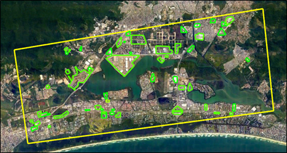
    <figcaption>Illustration of an annotated region in the vicinity of Rio de Janeiro, Brazil. The region boundaries are indicated by the yellow rectangle. Annotated heavy construction sites from the SMART dataset are indicated by the green polygons.</figcaption>
  </figure>
</div>

<div style="text-align: center;">
  <figure>
    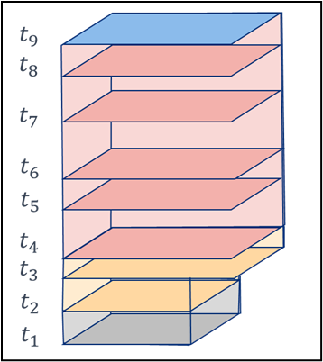
    <figcaption>Cartoon illustration of an annotated site model with nine (9) observations at times t<sub>1</sub> through t<sub>9</sub>. Each observation contains a polygon representing the spatial boundary of the activity at that time step. Notice how the polygon size can change with time as the activity (construction) expands. Each observation also contains one of five (5) phase labels (shown here in different colors) representing the phase of activity observed at that time step.</figcaption>
  </figure>
</div>

# SMART System Capabilities

The IARPA SMART Heavy Construction dataset was created to promote development of algorithms capable of three tasks: 

- **Broad area search (BAS)**: Detect and localize (spatially and temporally) activities in a sequence of
images
- **Activity classification (AC)**: Label the detected activity at each observation (time step) as one of a
specified set of activity phases (See Table 1)
- **Activity prediction (AP)**: For a given site that is not yet observed in an end-state, predict when the
end-state transition will occur

# SMART Heavy Construction Annotation Dataset 

For the purposes of the IARPA SMART problem formulation, heavy construction activity is defined as any activity related to the construction of large scale buildings and associated infrastructure. 

Note that for this application, we are interested in spatially and temporally localizing the bounds of _all_ construction related activity. This means that we are not simply interested in the footprints of the buildings alone (as many remote sensing applications and existing benchmark datasets are). Instead, we consider all activity associated with the construction to be part of the activity including, but not limited to, preparation of the entire plot of land undergoing change and being used to support the construction activity or facilities and infrastructure that support the use of the final facility/buildings (e.g. parking lots associated with the buildings). 

Therefore, for our problem, we have defined the concept of a `site` which is meant to spatially and temporally bound all construction-related activity, not simply the building footprints of the buildings being constructed. Given the above, note that the spatial boundaries of SMART 'sites' are almost always larger than the building footprints themselves. The SMART Heavy Construction dataset does not include the explicit labeling of individual buildings themselves. See below for examples of site boundaries of positive examples (heavy construction activity which we intend algorithms to detect) and negative examples (heavy construction or large scale change which we intend algorithms **_not_** detect). 

(NOTE: The assignment of specific activity types to the positive and negative classes were explicitly defined to meet the needs of expected end-users at the time of problem definition. Other applications may require slightly different assignments and users of this dataset are encouraged to re-define the breakdown in other ways if desired. A list of the activity type of each site can be found [here](annotations\supplemental_data\supplemental_annotation_info.json).

## Positive activity types

For the purposes of the IARPA SMART Heavy Construction Dataset, the following activity types are considered to be in the 'positive' set. That is, we expect algorithms to detect these types of heavy construction activity. 

- Medium Residential (Low-rise apartments/condos, townhouse/row homes with 5 stories or below, Does not matter how many of these buildings there are)
- Heavy Residential (Large apartment or condo high rise building that is over 5 stories tall)
- Commercial (e.g. malls, grocery stores, strip malls, gas stations, hospitals, stadiums, office buildings, hotels, storage units)
- Industrial (e.g. factories, power plants, manufacturing facility, warehouses, distribution center, shipping infrastructure (shipping ports) etc.)
- Other: A known type that doesn't fall into any of the above categories. (e.g. schools, parking garages, religious buildings, power substations, fire stations, etc.)

Other considerations for 'Positive' activity types, or activity that should be included within site boundaries:

- Sports fields if also associated with large-scale construction buildings (i.e., a school with new sports fields)
- Roads/driveways/Parking lots that are associated with construction of a build (i.e., a parking lot that is part of a new store, a new access road that leads to a new factory)
- The creation of artificial islands/land if associated with the construction of a man-made structure on that land

| 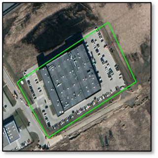 | 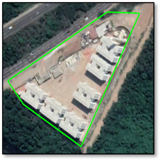 | 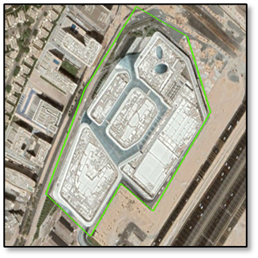 | 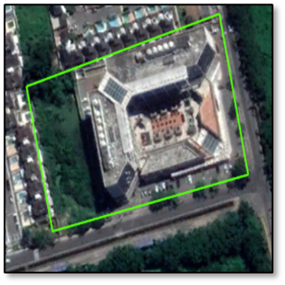 |
|:----------------------:|:----------------------:|:----------------------:|:----------------------:|
| Industrial              | Industrial              | Commercial              | Commercial              |

| 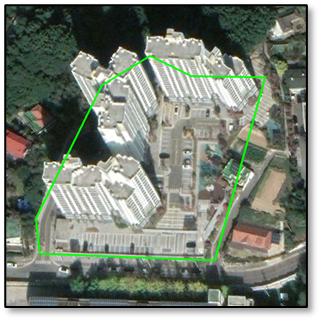 |  | 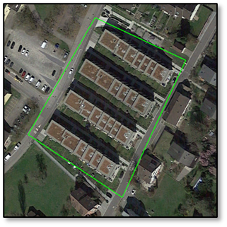 | 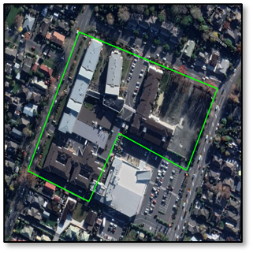 |
|:----------------------:|:----------------------:|:----------------------:|:----------------------:|
| Heavy Residential              | Heavy Residential              | Medium Residential              | Medium Residential               |

### _Examples of site progressions over time_

<div style="text-align: center;">
  <div style="display: flex; justify-content: center; align-items: center; gap: 20px">
      <video width="400" height="400" controls>
        <source src="resources/pos_site_US.mp4" type="video/mp4">
      </video>
      <video width="400" height="400" controls>
        <source src="resources/pos_site_BR.mp4" type="video/mp4">
      </video>
      <video width="400" height="400" controls>
        <source src="resources/pos_site_AE.mp4" type="video/mp4">
      </video>
  </div>

  <p style="margin-top: 10px; font-size: 16px;">Examples of time-lapsed progression of heavy construction activity. Imagery shown is Sentinel 2 imagery from Copernicus Sentinel Hub EO Browser
  </p>
</div>

## Negative activity types

For the purposes of the IARPA SMART Heavy Construction Dataset, the following activity types are considered to be in the 'negative' set. That is, we expect algorithms to detect these types of heavy construction activity. 

- Light residential (A collection of one or more detached single family homes)
- Sports fields not associated with the construction of large building or facility
- Golf courses (even with the presence of a clubhouse)
- Standalone surface parking lots not associated with the construction of at least one other 'Positive' example (e.g. a park and ride, an airport parking lot)
- Standalone roads infrastructure (not directly associated with the construction of buildings) including interchanges, bridges, tunnels
- Change that is a result of a natural disaster (e.g. tornado, hurricane, flood, etc.)
- The general clearing of land or destruction of a building/structure without the explicit or immediate purpose of continued construction (e.g. the destruction of a stadium or factory on land that is then abandoned)
- The creation of water retention ponds, unless directly associated with the construction of a 'Positive' example
- Solar panel "fields"

| 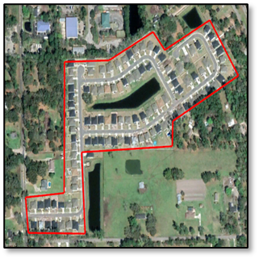 | 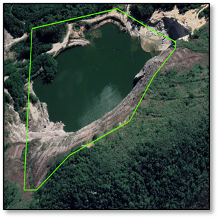 | 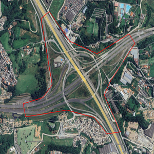 |
|:----------------------:|:----------------------:|:----------------------:|
| Light residential              | Infrastructure              | Road Infrastructure              |

| 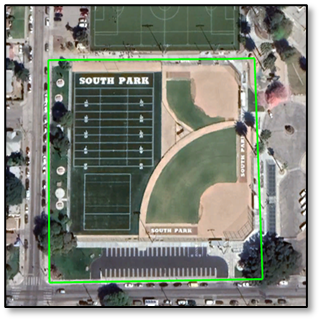 | 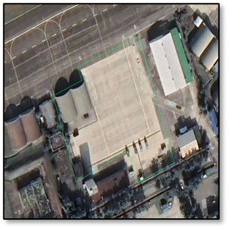 | 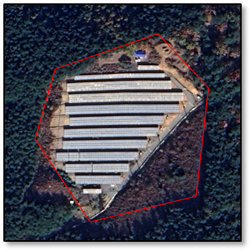 |
|:----------------------:|:----------------------:|:----------------------:|
| Recreational Fields             | Resurfacing       | Solar Panels              |

## '_Ignore_' Sites

For the purposes of the IARPA SMART Heavy Construction Dataset, activity that is either ambiguous or otherwise unknown at the time of annotation are labeled as 'ignore'. These sites should not be counted or considered in the evaluation of algorithm performance. 

## Activity Phase Labels

To support Activity Classification (AC) and Activity Prediction (AP) tasks, the SMART Heavy Construction dataset defines the following labels to describe the phase of activity at any point in time. These definitions are pulled from [1]. 

<table style="width: 80%; margin: auto; border: 1px solid white;">
  <tr>
    <th style="width: 20%; text-align: center; vertical-align: middle;">Phase</th>
    <th style="width: 80%; text-align: center; vertical-align: middle;">Description</th>
  </tr>
  <tr>
    <td style="text-align: center; vertical-align: middle; background-color: #DFDFDF; color: black;">No Activity</td>
    <td>
      <ul>
        <li>Status quo for any given site. What the scene looks like before activity started.</li>
        <li>Default class for un-annotated areas before any activity begins</li>
        <li>An algorithm is not expected to detect this phase or anticipate transitions out of this phase. Observations of sites in this phase are included in site models for algorithm training purposes only.</li>
      </ul>
    </td>
  </tr>
  <tr>
    <td style="text-align: center; vertical-align: middle; background-color: #FFDFBF; color: black;">Site Preparation</td>
    <td>
      <ul>
        <li>Includes activity such as ground clearing, ground shaping, and other activity related to preparing the site for construction.</li>
        <li>Earliest possible annotated activity phase class for a site.</li>
      </ul>
    </td>
  </tr>
    <tr>
    <td style="text-align: center; vertical-align: middle; background-color: #F3B1AC; color: black;">Active Construction</td>
    <td>
      <ul>
        <li>This phase defines when objects in the scene are actively being built, including building foundations and supporting infrastructure.</li>
        <li>Includes activity such as pre-foundation and foundation building, transient construction, building of intermediate structures, etc.</li>
      </ul>
    </td>
  </tr>
    <tr>
    <td style="text-align: center; vertical-align: middle; background-color: #8BBBEB; color: black;">Post Construction</td>
    <td>
      <ul>
        <li>Phase in which apparent completion of all construction activity within the site or sub-site bounds has occurred.</li>
        <li>At least one view of post-construction is required to be annotated for each site model, assuming the construction has been completed within the temporal bounds of the datacube. More may be provided if available.</li>
      </ul>
    </td>
  </tr>
    <tr>
    <td style="text-align: center; vertical-align: middle; background-color: #C87FF5; color: black;">Unknown</td>
    <td>
      <ul>
        <li>No image or external information source is available to reliably classify that observation as being in a specific phase.</li>
        <li>Will always occur in the temporal gap between phase transitions (e.g. between ‘Site Prep’ and ‘Active Construction’). Unknown labels will never occur between two labels of the same activity (e.g. between two 'Site Prep' labels). This is because it is assumed that once a given phase starts, it is assumed to continue until and unless indicated otherwise in a subsequent observation.</li>
      </ul>
    </td>
  </tr>
</table>

<div style="text-align: center;">
  <figure>
    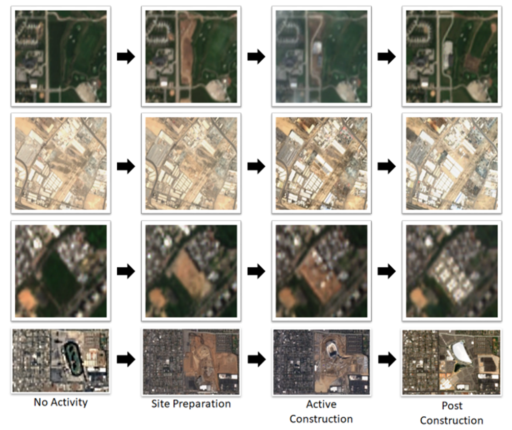
    <figcaption>Progression of four construction sites through each of the four phases defined above. All images shown are from Sentinel-2. Figure is taken from [1].</figcaption>
  </figure>
</div>

## Annotation Types

The SMART Heavy Construction Dataset consists of different types of annotations, each with unique characteristics and intended for a specific purpose. The table below provides a description of these site types. While all types can be used for BAS algorithm development and evaluation, only Types 1 and 2 can be used for AC and AP. Type 3 sites are intended to be the `negative` class.

<div style="display: flex; justify-content: center;">
  <table>
    <tr>
      <th style="text-align: center;">Type</th>
      <th style="text-align: center;">No. of Annotated<br>Observations Per Site</th>
      <th style="text-align: center;">Has Phase Labels?</th>
      <th style="text-align: center;">Completed Activity?</th>
      <th style="text-align: center;">Notes</th>
    </tr>
    <tr>
      <td style="text-align: center;">1</td>
      <td style="text-align: center;">Many</td>
      <td style="text-align: center;">Yes</td>
      <td style="text-align: center;">Yes</td>
      <td style="text-align: center;">Positive Sites</td>
    </tr>
    <tr>
      <td style="text-align: center;">2</td>
      <td style="text-align: center;">Many</td>
      <td style="text-align: center;">Yes</td>
      <td style="text-align: center;">No</td>
      <td style="text-align: center;">Positive Sites</td>
    </tr>
    <tr>
      <td style="text-align: center;">3</td>
      <td style="text-align: center;">2 (Start and End)</td>
      <td style="text-align: center;">No</td>
      <td style="text-align: center;">Yes</td>
      <td style="text-align: center;">Negative Sites</td>
    </tr>
    <tr>
      <td style="text-align: center;">4</td>
      <td style="text-align: center;">2 (Start and End)</td>
      <td style="text-align: center;">No</td>
      <td style="text-align: center;">Yes or No</td>
      <td style="text-align: center;">Positive sites pending phase labels</td>
    </tr>
  </table>
</div>

## Primary and Supplemental Datasets

The content of this section is extracted from [1].

The SMART Heavy Construction dataset is further categorized by the annotation process and the purpose for which annotations were generated. These categories, described in the table below, notionally describe a tradeoff between annotation quality and quantity. This table also notes which site types are included in each dataset. The following sections provide additional nformation on each of these two dataset categories, which we generically refer to here as the `Primary Dataset` and the `Supplemental Dataset`. 

<div style="display: flex; justify-content: center;">
  <table>
    <tr>
      <th style="text-align: center;">Dataset</th>
      <th style="text-align: center;">No. of Annotated<br>Site Models (All Types)</th>
      <th style="text-align: center;">Relative Quality</th>
      <th style="text-align: center;">Used For</th>
      <th style="text-align: center;">Site Types Included</th>
    </tr>
    <tr>
      <td style="text-align: center;">Primary</td>
      <td style="text-align: center;">Lower</td>
      <td style="text-align: center;">Higher</td>
      <td style="text-align: center;">BAS, AC, and AP</td>
      <td style="text-align: center;">1, 2, 3, 4</td>
    </tr>
    <tr>
      <td style="text-align: center;">Supplemental</td>
      <td style="text-align: center;">Much Higher</td>
      <td style="text-align: center;">Lower</td>
      <td style="text-align: center;">BAS Only</td>
      <td style="text-align: center;">4</td>
    </tr>
  </table>
</div>

- TODO: Add a list of regions and an indication of whether they are Primary/Secondary and whether the region is cleared. 

## Dataset Statistics

Activity in all regions are annotated over the span of more than 7.5 years from at least January 2014 through August 2021. In many cases, sites outside of these temporal bounds are also included for algorithm training and validation purposes. However, evaluation is limited to the dates identified above due to increased reliability and availability of sufficient information to support annotation of site boundaries and phase labels. [1].

TODO: Add Map
TODO: Chart showing total number of positive and negatives sites in each dataset
TODO: Chart showing how many observations and annotated phase labels


## File Format Specifications

The IARPA SMART Heavy Construction Annotation Dataset is provided in a custom, yet simple human- and machine-readable format ([geoJSON](https://geojson.org/)). More details can on the format can be found in our documentation (found in `documentation/specifications/`). 

## Obtaining the Satellite Imagery

See [here](documentation/obtain_imagery.md) for more information on obtaining the satellite imagery corresponding to this dataset. 

# Terms and Conditions
The contents of this public dataset are provided under the MIT License license. 

Any publication using the dataset or any contents herein in any way should refer to the following paper: 

```
@inproceedings{goldberg2023spie,
	author={Hirsh R. Goldberg and Christopher R. Ratto and Amit Banerjee and Michael T. Kelbaugh and Mark Giglio and Eric F. Vermote},
	booktitle={Geospatial Informatics XIII},
    volume={12525}, 
	title={Automated global-scale detection and characterization of anthropogenic activity using multi-source satellite-based remote sensing imagery}, 
	year={2023}, 
    doi={10.1117/12.2663071},
    URL={https://doi.org/10.1117/12.2663071}
}
```

# Acknowledgments
This work was supported by the Office of the Director of National Intelligence (ODNI), Intelligence Advanced Research Projects Activity (IARPA) under contract numbers 2017-17032700004 and 2020-20081800401. The views and conclusions contained herein are those of the authors and should not be interpreted as necessarily representing the official policies, either expressed or implied, of ODNI, IARPA, or the U.S. Government. 

Development of the dataset was also supported by: 
- CrowdAI
- iMERIT

# References
[1]: H.R. Goldberg et al., "Automated global-scale detection and characterization of anthropogenic activity using multi-source satellite-based remote sensing imagery" in Geospatial Informatics XIII, SPIE, vol. 12525, pp. 12525-1, 2023.

# Contact the authors
Please reach out to iarpa.smart@jhuapl.edu with any questions or feedback. 


