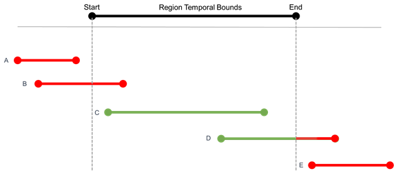

# Example Outputs for Region BR_R002

The SMART test harness compares proposed site models against ground
truth annotations, computes quantitative metrics to measure their
similarity, and writes them to the local file system as CSV files.

The metrics outputted by the test harness are [broad area search](overall/bas/README.md#broad-area-search-metrics) metrics and [phase activity](overall/phase_activity/README.md#phase-activity-metrics) metrics.

The primary inputs to the test harness, which are the ground truth annotations and the proposed site models, are listed in the gt\_sites.csv file and sm\_sites.csv file, respectively.

## gt\_sites.csv

This table lists each of the ground truth site annotations that are ingested into the test harness via the [–gt\_dir](../../../README.md#arguments) command line argument.

| Columns              | Description          |
|-----------------------------|---------------|
| id | The unique identifier of the truth site.
| status | The annotated status type of the truth site as specified in the annotation file. This is irrespective of the site’s spatial size or its temporal range relative to the region model.
| polygon union area | The area (sq km) of the truth site. Specifically, the area of the geometric union of the truth site’s temporally bounded polygon observations. (An observation date is temporally bounded if it occurs on or between the region model’s start and end dates.)   This measurement is what the test harness generally uses for metrics involving a site’s (approximate) area.
| maximum polygon area | The area (sq km) of the truth site’s largest temporally bounded polygon. This measurement is used to determine whether a truth site is small enough to be “ignored” for the purposes of site association and scoring.
| confidence score | This defaults to 1.0 for a ground truth site.
| first observation | The site’s first temporally bounded observation date.
| start date | The annotated site-level start date or the region model’s start date, whichever occurs later.
| earliest start | For positive truth sites with phase labels (site types 1 and 2), this field is the earliest possible start date of the observed activity, that is, the latest 'No Activity' observation date that occurs before the first 'Site Preparation' or 'Active Construction' observation date, when activity definitely begins.   If this 'No Activity' observation date occurs before the start of the region model, then the earliest start date (of *observed* activity) is effectively the region model’s start date. If there is no such 'No Activity' observation date, this field defaults to the “latest start” date. This field is not applicable for other types of truth sites and is left empty.
| latest start | For positive truth sites with phase labels (site types 1 and 2), this field is the latest possible start date of the observed activity, that is, the earliest 'Site Preparation' or 'Active Construction' observation date in the site. If this date occurs before the region model start date, then the latest start date (of *observed* activity) is effectively the region model’s start date (and the test harness will also update this site’s status to positive\_unbounded).
| start activity | Used to denote the start of a site’s temporal range for the purposes of site association. Defaults to the date of the “latest start” for positive truth sites with phase labels, and to the site-level “start date” for all other site types.
|end activity | Used to denote the end of a site’s temporal range for the purposes of site association. For positive truth sites with phase labels, this field is the end of the site’s observed activity, and is set to the region model’s end date or to the first 'Post Construction' observation date, whichever occurs first. For all other site types, this field defaults to the site-level “end date”.
| end date | The annotated site-level end date or the region model’s end date, whichever occurs earlier.
| last observation | The site’s last temporally bounded observation date.

## sm\_sites.csv

This table lists each of the proposed site models that are ingested into the test harness via the [–sm\_dir](../../../README.md#arguments) command line argument.

| Columns              | Description          |
|-------------------------------|-------------|
| id |The unique identifier of the proposed site.
| status | A label that indicates whether the proposal should be scored by the test harness or ignored. A proposal annotated as “system\_confirmed” will be compared to the ground truth sites; a proposal with any other label, such as “system\_rejected”, will be effectively ignored.
| polygon union area | The area (sq km) of the proposed site, that is, the geometric union of the site’s temporally bounded polygon observations. This measurement is what the test harness generally uses for metrics involving a site’s (approximate) area.
| maximum polygon area | The area (sq km) of the proposed site’s largest temporally bounded polygon.
| confidence score | The annotator’s level of confidence in the site proposal, ranging from 0 (least confident) to 1 (most confident) that the proposal correctly captures actual activity of interest.
| first observation | The site’s first temporally bounded observation date.
| start date | The annotated site-level start date or the region model’s start date, whichever occurs later.
| earliest start | This field is not used for proposed sites and is left empty.
| latest start | This field is not used for proposed sites and is left empty.
| start activity | Used to denote the start of a site’s temporal range for the purposes of site association. This field defaults to the same date as the “start date”.
| end activity | Used to denote the start of a site’s temporal range for the purposes of site association. This field defaults to the same date as the “end date”.
| end date | The annotated site-level end date or the region model’s end date, whichever occurs earlier.
| last observation | The site’s last temporally bounded observation date.

## Metric Subsets

The test harness filters and selects 3 different subsets of the ground
truth sites before comparing them with the proposed site models and
computing the association and performance metrics. 

The “overall” metrics are computed on the subset of truth sites that begin within the region
model’s start date and end date (types C and D).  The “completed” metrics are computed on the subset of truth sites that begin *and end* within the region model’s start date and end date (type C).  The “partial” metrics are computed on the subset of truth sites that begin but do
*not* end within the region model’s start date and end date (type D).

 The test harness computes the full set of metrics on each of these 3
subsets and writes them to their respective folders:

-   completed/

    -   This folder contains the full set of test harness metrics
        computed on the subset of truth sites that begin and complete
        their activity within the region model’s temporal bounds. All
        other truth sites are effectively ignored.

    -   In general, this folder has the same kind of metrics content as
        the “overall” folder; however, some files might not appear if
        there were no associations with the “completed” subset of truth
        sites. For example, the `phase_activity` folder will be empty if there were no dections of the fully completed positive truth sites.

-   partial/

    -   This folder contains the full set of test harness metrics
        computed on the subset of truth sites that began but did *not*
        complete their activity within the region model’s temporal
        bounds. All other truth sites are effectively ignored.

    -   In general, this folder has the same kind of metrics content as
        the “overall” folder; however, some files might not appear if
        there were no associations with the “partial” subset of truth
        sites. For example, the `phase_activity` folder will be empty if there were no dections of the partially completed positive truth sites.

-   overall/

    -   This folder contains the full set of test harness metrics
        computed on the subset of truth sites that began their activity
        within the region model’s temporal bounds. All other truth sites
        are effectively ignored.
